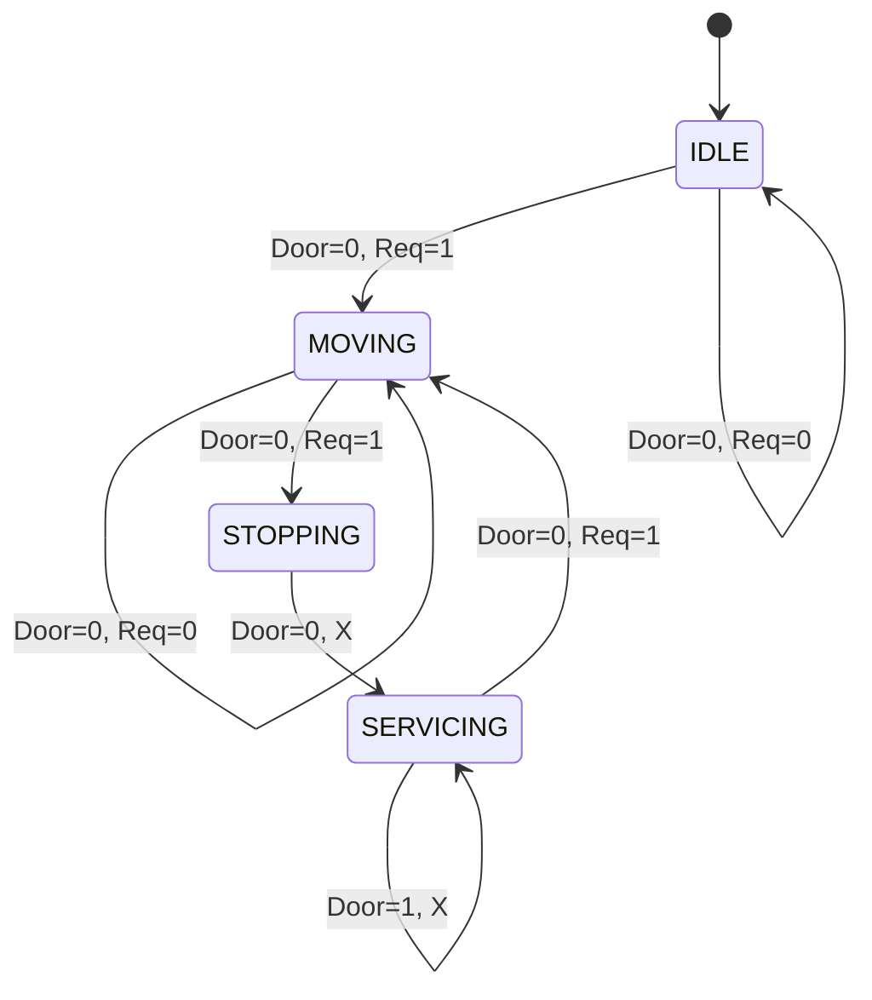

# Elevator-Controller

Created an automated elevator system using digital logic principles, verified in software, and implemented on Arduino UNO. 

## Design Process

1. **Logic Design**: Start by designing truth table for transitions.
2. **FSM**: Derived FSM from truth table
3. **Software verification**: Implemented prototype logic on Python and wrote a testbench to validate before taping out on Arduino Uno
4. **HW implementation**: Rewrote logic with C++ code, and then integrated with Arduino Uno, IR sensors, and 7 segment digit display. 

### Elevator Safety Logic Table

There are 4 states, which is IDLE, MOVING, STOPPING, and SERVICING. 
When Door sensor is 1 it means the door is open. When Request is 1 then the state should be updated to the next state. 

| State | Door | Req | Hardware Action | Next State |
|-------|------|--------|--------|-------------|
| IDLE | 0 | 0 | Display Current Floor | IDLE |
| IDLE | 0 | 1 | Start floor increment | MOVING |
| MOVING | 0 | 0 | Update 7 seg display | MOVING |
| MOVING | 0 | 1 | Stop increment | STOPPING |
| STOPPING | 0 | X | Trigger stop sequence | SERVICING |
| SERVICING | 1 | X | Hold display/timer | SERVICING |
| SERVICING | 0 | 1 | Resume Movement | MOVING |

### Finite State Machine
My FSM is a Moore Machine because the output is tied directly to the current state. 

### Software Verification
In order for the elevator to hit all the floors without missing out on any, I implemented the LOOK algorithm to make sure it can traverse accordingly when going up and also traverse down accordingly without going to floors out of order. I prioritized 2 things when validating with python: Making sure that the LOOK algorithm worked and making sure that I can simulate the Limited Memory that the Arduino had so I make sure I am within memory bounds when I eventually do HW Implementation. To simulate how I would run my code on Arduino, I defined registers in my python file and the way I would traverse would be through bitwise shifting rather than rigidly incrementing or decrementing pointers. I wrote a test bench to make sure my code can work with limited physical memory and any test cases that could potentially break my elevator. To keep it simple, I made sure my elevator always reset to floor 1 after all requests are done. 

### HW Implementation

I am implementing HW using Arduino Uno Logic Design Kit. Before I rewrote my python into C++ code, I had to plan the hardware logics. My plan is to use a IR sensor and IR remote for the floor request inputs. I did not use buttons because in my starter kit only 5 were available and the LED remote had more buttons in order to have inputs for 7 Floors. To control the 7 Segment Digit LED, I used a SN74HC595N, which controlled each of the 7 pins in the Segment Digit LED.  Based on the inputs, the DIGIT LED would traverse up the the request, pause shortly and if there are no more requests then it would reset back to Floor 1. I used 200 Ohm resistors to make sure the current from the IC to the DIGIT LED to make sure I did not short circuit my board. Another reason why I used them is because if the resistor values were too high then the brightness of the DIGIT LED would get affected. Bigger resistance, less lumination. 

### LIVE DEMO

Short brief 2 min demo of my HW Implementation 
https://drive.google.com/file/d/1Zto44eqLIpA5ts1MA2sN1pTSYvKO7q3h/view?usp=sharing

