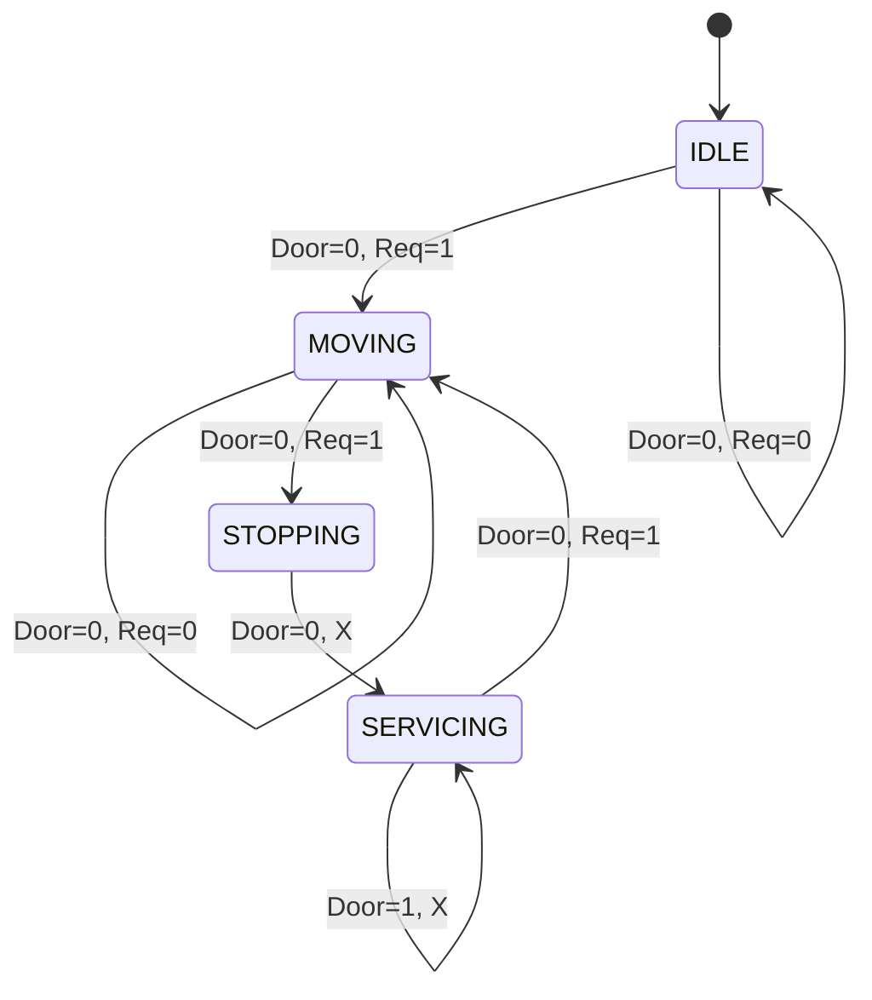

# Elevator-Verification (Arduino Uno)

Created an automated elevator system using digital logic principles, verified in software, and implemented on physical hardware. 

## Design Process

1. **Logic Design**: Start by designing truth table for transitions.
2. **FSM**: Derived FSM from truth table
3. **Software verification**: Implemented prototype logic on Python and wrote a testbench to validate before taping out on Arduino Uno
4. **Physical implementation**: Rewrote logic with C++ code, and then integrated with Arduino Uno, IR sensors, and 7 segment digit display. 

### Elevator Safety Logic Table

There are 4 states, which is IDLE, MOVING, STOPPING, and SERVICING. 
When Door sensor is 1 it means the door is open. When Request is 1 then the state should be updated to the next state. 

| State | Door | Req | Hardware Action | Next State |
|-------|------|--------|--------|-------------|
| IDLE | 0 | 0 | Display Current Floor | IDLE |
| IDLE | 0 | 1 | Start floor increment | MOVING |
| MOVING | 0 | 0 | Update 7 seg display | MOVING |
| MOVING | 0 | 1 | Stop increment | STOPPING |
| STOPPING | 0 | X | Trigger stop sequence | SERVICING |
| SERVICING | 1 | X | Hold display/timer | SERVICING |
| SERVICING | 0 | 1 | Resume Movement | MOVING |

### Finite State Machine
My FSM is a Moore Machine because the output is tied directly to the current state. 

